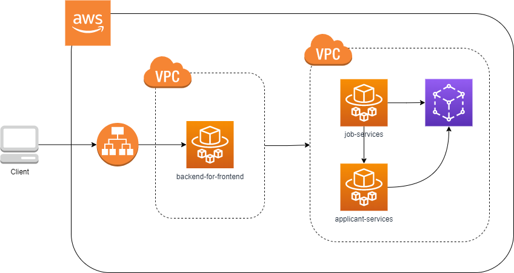
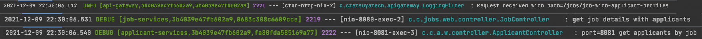

# Microservice Architecture with Spring

Microservice is a service-oriented architecture where an application is deployed as a collection of loosely-couple 
services. The goal is to make each service independent, fine-grained, scalable and flexible which allows faster 
testing and release.



## Our Microservices

### Business Services

applicant-services - Dummy service that returns a list of applicant names.

```java
@GetMapping("/applicants-by-job")
public List<String> getApplicantsByJob() {
 
    log.debug("port={} get applicants by job", port);
    return Arrays.asList("Steve", "Bill", "Linus");
}
```

job-services - Dummy service that returns a job title with a list of applicant names.

```java
@GetMapping("/job-with-applicant-profiles")
public ResponseEntity listJobsWithApplicantProfiles() {
 
    log.debug("get job details with applicants");
 
    JobWithApplicantsDto result = new JobWithApplicantsDto();
    result.setJob("Java Developer");
 
    result.setApplicants(applicantProxy.getApplicantsByJob());
 
    return ResponseEntity.ok().body(result);
}
```

### Spring Cloud Services

- naming-server / discovery-server

This server holds all the information about our microservices such as name, IP, and port. This information is used for exchanging a service name to IP address and port.

A simple naming-server typically has:

```java
// pom.xml
<dependency>
<groupId>org.springframework.cloud</groupId>
<artifactId>spring-cloud-starter-netflix-eureka-server</artifactId>
</dependency>

// in application.yml
    eureka:
    client:
    register-with-eureka: false
    fetch-registry: false

// in SpringBootApplication annotated class
@EnableEurekaServer
```

- api-gateway

It's a server that provides criteria-driven request routing. It also offers other features such as security, load balancing, logging, monitoring, etc.

API Gateway is not at all different to the naming-server. Thanks to Spring for doing the heavy lifting:

```java
// pom.xml
<dependency>
    <groupId>org.springframework.cloud</groupId>
    <artifactId>spring-cloud-starter-gateway</artifactId>
</dependency>
 
// @Configuration annotated class
@Bean
public RouteLocator gatewayRouter(RouteLocatorBuilder builder) {
 
    return builder.routes()
        .route(p -> p
            .path("/get")
            .uri("http://httpbin.org"))
        .route(p -> p.path("/applicants/**")
            .uri("lb://applicant-services"))
        .route(p -> p.path("/jobs/**")
            .uri("lb://job-services"))
        .build();
}
```

## Spring Cloud Libraries

- spring-cloud-starter-openfeign - this library is used for referencing a service in the naming server

To enable this feature, @EnableFeignClients must be annotated to a configuration class.

To call an endpoint from another service, an interface must be created with the same method signature as the method from the other service. In this example, we are importing 2 endpoints from the applicant-service.

```java
@FeignClient(name = "applicant-services")
public interface ApplicantProxy {
 
    @GetMapping("/applicants/applicants-by-job")
    List<String> getApplicantsByJob();
 
    @GetMapping("/applicants/top-applicants-by-job")
    public List<String> getTopApplicantsByJob();
}
```

- spring-cloud-starter-netflix-eureka-client - this library provide the necessary classes for our services to 
register to the discovery server.

To register to a naming-server, we need to add this configuration in each of the services:

```java
eureka:
  client:
    serviceUrl:
      defaultZone: http://localhost:8761/eureka // make sure that this address is correct
```

- spring-cloud-starter-sleuth - this library helps us trace our requests across different microservices by 
automatically adding a unique id to the logs.

As we can see in the logs, it started from api-gateway, pass thru job-services, and then application-services. In the 3 logs, notice the common unique id: 3b4039e47fb602a9. We can use this when tracing a request.



## Services URLs

### Eureka Server
http://localhost:8761

### Applicant Services
http://localhost:8081/applicants/applicants-by-job
http://localhost:8081/applicants/top-applicants-by-job

### Job Services
http://localhost:8080/jobs/job-with-applicant-profiles
http://localhost:8080/jobs/job-with-top-applicants

### API Gateway
http://localhost:8000/applicants/applicants-by-job
http://localhost:8000/applicants/top-applicants-by-job
http://localhost:8000/jobs/job-with-applicant-profiles
http://localhost:8000/jobs/job-with-top-applicants